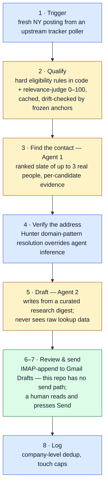

# Adam

> *The Creation of Adam* — two hands reaching across a small gap.

An agentic outreach pipeline: a fresh job posting goes in; a personalized
cold email to the person who can act on it comes out — sitting in Gmail
Drafts, because **no code path in this repo can send a message**. LLM
agents do the research and the writing; deterministic code owns every
consequence. The gap it closes is the one between a company realising it
needs someone and that someone hearing from me directly, before the
applicant queue forms.

Two agents, eight stages, one architectural rule:

> Deterministic code for anything with a lasting real-world consequence.
> Probabilistic work for anything a human doesn't want to spend their own
> time on, where getting it wrong costs a retry, not a real mistake.

Everything below is measured, not asserted. The depth docs linked at the
bottom carry the full evidence.

## The relevance judge tracks the real market

The pipeline's fit score is an LLM judge's 0–100, batched and cached, with
frozen anchor postings riding in every batch as a drift alarm. To calibrate
it against ground truth, I mined my own inbox for genuine interview
processes, judged those postings blind, and compared score to how far each
process actually went:

| Role | Judge | Process reached |
|---|--:|---|
| Forward Deployed Engineer, company-m | 92 | interviewed |
| Forward Deployed Engineer, company-n | 88 | full loop, 3-hour NYC onsite |
| Full-Stack SWE (deployed), company-o | 87 | live, technical round done, awaiting the next |
| Forward Deployed Engineer, company-p | 85 | screen plus two team conversations, then rejected |
| SWE II (finance), company-r | 70† | full loop, rejected at the end |
| Software Engineer (fintech), company-q | 58 | first round, then rejected |
| Python Dev (staffing), company-s | 8 | recruiter screen only |

† Re-judged on the complete posting text; the original 55 was scored on a
partial reconstruction. The re-judge moved it above both company-q and the
65 spend bar.

**Every process the judge scored 85+ produced a real conversation, and the
two processes below 85 that reached an interview both ended in
rejection.** That is the claim the gate is accountable for. It answers
"is this a job worth being contacted about," and its measurable output is
whether a conversation happens. What happens inside the room is interview
performance, comp, and timing, none of which a posting's text predicts.
Two corrections are recorded here rather than smoothed over: the first 85
to reject me (company-p, after two team conversations) retired an earlier
"nothing at 85+ has said no" claim, and the re-judged 70 went deeper than
that 85 did, which weakened the strict depth-ordering claim this section
used to lead with.

The instructive row is still company-n: the posting demands 3+ years of
customer-facing work (a hard miss on paper), but the judge scored the
substance of the ERP-integration experience instead, and the market
agreed, running me through a full onsite.

Since that calibration, seven more processes arrived in a single week,
every one an embedded or forward-deployed shape, every one judged 82–92:

| Role | Judge | How it started |
|---|--:|---|
| Forward Deployed Engineer, company-af | 92 | inbound, recruiter screen |
| Forward Deployed Engineer, company-ag | 92 | inbound, recruiter outreach |
| Forward Deployed Engineer, company-ah | 90 | inbound, three unrelated recruiters in the same week |
| Forward Deployed Engineer, company-aj | 88 | inbound, recruiter screen |
| Forward Deployed Engineer, company-ak | 85 | this pipeline's cold email; the co-founder/CTO replied the same morning |
| Forward Deployed Engineer, company-al | 85 | inbound message on a posting the judge had already cached at 85; intro call |
| Founding Engineer, company-am | 82 | this pipeline's cold email; the CEO replied within two hours and a meeting was booked the same day |

The inbound rows are the strongest confirmation available: recruiters
reached out to me on postings the judge had independently scored 88–92.
The two cold-email rows are the outreach half's first reply and first
end-to-end conversion, from its first sixteen sent emails, most of them
less than a week old at the time of writing. The counter-example is the
gate working the other way: an FDE-titled posting judged 40, because its
actual bar was production data science, caught before any spend.

Caveats stated where they belong: small n, survivorship-biased toward
roles I chose to pursue, the live rows are early-stage, and the two
concluded rejections ran on an older résumé, so the bands carry a
positioning gap as well as a score gap. The full tuning history —
threshold selection on a 56-posting week, validation against a second
167-judgement window, and the deletion of a weighted composite the moment
measurement showed it only subtracted from the judge — is in
[`docs/qualify.md`](docs/qualify.md).

## The contact finder went 5/5 — and its one confident answer was wrong

Agent 1 (a Claude subagent with web search) was spiked against five small
NY companies from live pipeline output. **All five runs named a real,
checkable decision-maker** — a CTO, a VP Engineering, an SVP Engineering, a
Head of Engineering, a co-founder/CTO. Zero `info@` fallbacks. Then every
address it produced was verified against Hunter:

| Company | Address source | Verdict | Domain pattern agreed? |
|---|---|---|---|
| company-a | inferred from a press-page address | **invalid** (0) | no |
| company-e | observed directly | verified (89) | Hunter had no data — the agent was the only source |
| company-b | aggregator-derived pattern | verified (92) | yes |
| company-f | primary source | verified (100) | yes |
| company-g | inferred from a 2022 blog byline | **invalid** (0) | no |

**Agent 1 alone: 3/5 deliverable addresses. With deterministic pattern
resolution downstream: 5/5.** Both failures were the same mistake —
generalizing a domain's convention from one genuine but unrepresentative
address — and the agent's confidence was *mildly inverted*: its one
`high`-confidence answer was the wrong one, while its weakest-evidenced
answer was right.

That result is the whole design in miniature. The agent was confident,
sincere, well-sourced, and wrong, and a cheap deterministic check caught it
before a human could act on it. Address inference was moved out of the
agent entirely — a resolver reads the whole domain's pattern for one
Hunter credit — and the agent now reports people, not addresses. Full
sweep and both prompt defects it exposed: [`docs/agents.md`](docs/agents.md).

## Architecture

Blue is deterministic code, amber has an LLM in the loop, green is a
human. The approval gate is architectural, not procedural: sending was
deliberately replaced with an IMAP append to the Drafts folder, so
reaching a recipient strictly requires a person pressing Send in a mail
client. Context is restricted the same way — the drafting agent receives a
curated digest of public company facts, never the contact-research trail.

All eight stages are implemented and have run end to end against live
data (`outreach_run.py`, per-component state in
[`docs/status.md`](docs/status.md)).

## Where the depth is

- [`CLAUDE.md`](CLAUDE.md) — dense working context; the file the agents
  themselves read every session.
- [`PIPELINE.md`](PIPELINE.md) — the eight-stage design and the reasoning
  behind every decision marker.
- [`docs/qualify.md`](docs/qualify.md) — the judge's contract: tuning,
  second-window validation, the ground-truth eval above — and an honest
  bug report ("the judge was never wired into a live run", found by
  noticing a score that shouldn't exist, fixed the same day).
- [`docs/agents.md`](docs/agents.md) — both agent contracts, the full
  verification sweep, measured per-company cost.
- [`docs/decisions.md`](docs/decisions.md) — the decision log, including
  the build-vs-API research for contact finding.
- [`harvest/NOTES.md`](harvest/NOTES.md) — provenance of every piece of
  reused code.

---

*Company names in this README are aliased (`company-a`, `company-m`,
`company-af`, …). The postings, interview processes, and verification
results are real; the private parties aren't named here.*
